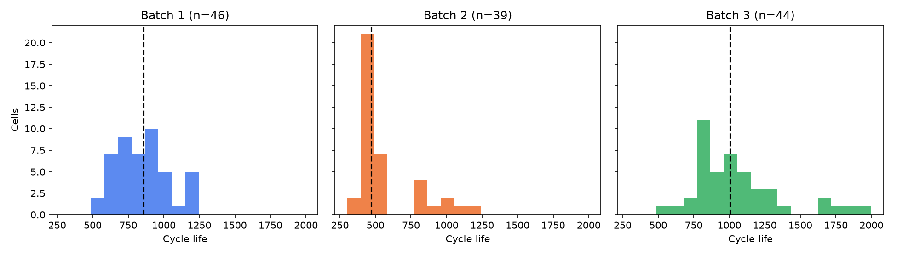
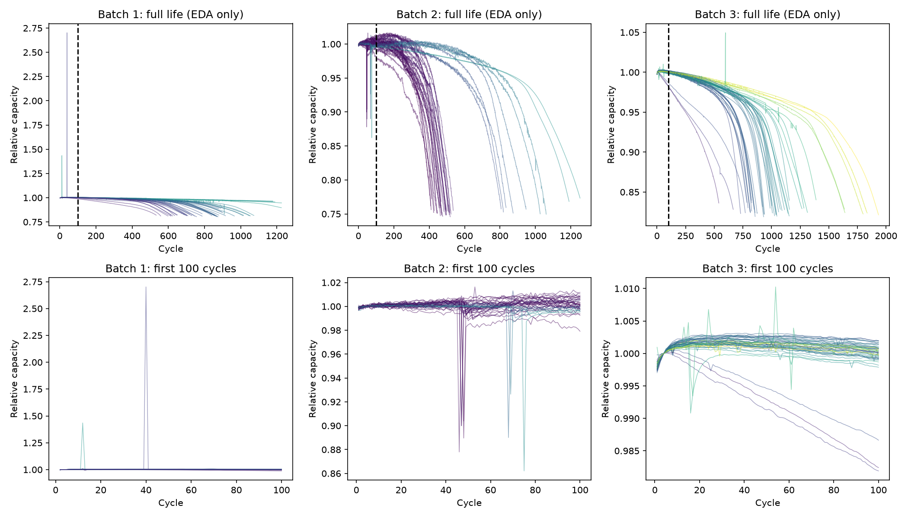
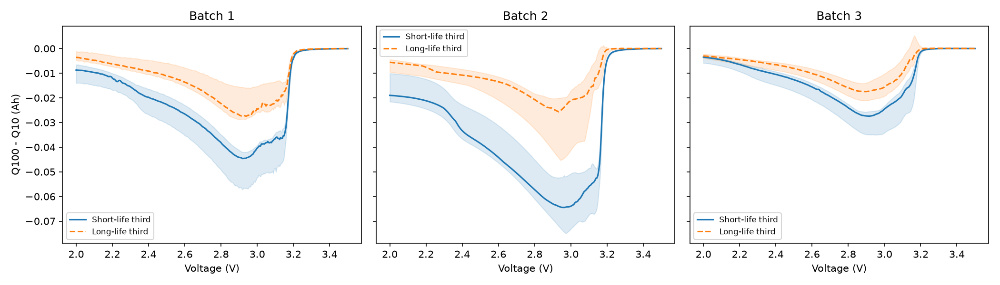
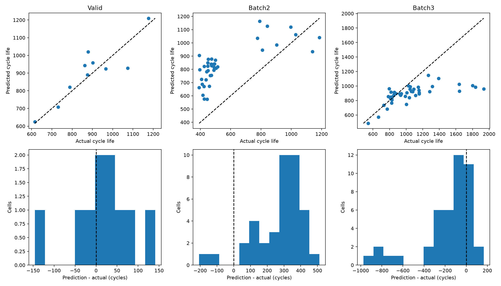

# ESS 배터리 수명 예측

초기 100사이클의 방전 곡선 변화와 충전 조건을 이용해 배터리의 전체 Cycle Life를 예측합니다. Batch 1 내부 검증과 Batch 2 평가를 비교하여 배치 간 분포 이동이 수명 예측에 미치는 영향을 분석합니다.

## 프로젝트 개요

- 데이터셋: MIT–Stanford Battery Dataset, Severson et al., Nature Energy (2019)
- 학습 데이터: Batch 1 (2017-05-12), 46셀
- 평가 데이터: Batch 2 (2018-02-20), 39셀
- 추가 평가: Batch 3 (2018-04-12), 44셀
- 태스크: Regression, `cycle_life` 예측
- 주 평가 지표: MAPE, 보조 지표: MAE·평균 부호 오차·과대 예측 비율

원본 139셀 중 Target이 없는 10셀을 제외합니다. 모델 입력은 초기 Cycle 1–100으로 제한하고 Target·셀 ID·배치·knee point는 피처에서 제외합니다. Batch 1에 단수명(<550) 셀이 1개뿐이므로 분류 대신 회귀를 수행합니다.

## 파일 구조

```text
├── data/
│   ├── README.md
│   └── *.mat
├── notebooks/
│   ├── 01_EDA.ipynb
│   ├── 02_feature_engineering.ipynb
│   └── 03_modeling.ipynb
├── src/
│   ├── preprocess.py
│   ├── features.py
│   ├── train.py
│   ├── modeling.py
│   ├── eda.py
│   ├── reporting.py
│   └── verify_results.py
├── config/
│   ├── experiment.json
│   └── split_manifest.json
├── scripts/
│   └── build_notebooks.py
├── tests/
├── results/
│   ├── model_performance.csv
│   ├── eda/
│   └── experiment/
├── requirements.txt
└── README.md
```

## 환경 설정

Python 3.11 환경에서 실행합니다. 원본 데이터 파일은 `data/README.md`의 목록에 맞게 준비합니다.

```bash
python3.11 -m venv .venv
source .venv/bin/activate
pip install -r requirements.txt
python -m unittest discover -s tests -v
python -m src.eda
python -m src.train --output results/my_experiment
python -m src.verify_results results/my_experiment
jupyter lab
```

노트북은 01 → 02 → 03 순서로 읽습니다. 현재 실행 결과는 `results/experiment/`에 있습니다. 별도 실행 시 비어 있는 출력 폴더를 지정합니다. `src.train`은 `results/model_performance.csv`에 해당 실행의 제출용 성능 표도 저장합니다. 노트북 전체 생성·실행은 `python scripts/build_notebooks.py`로 수행하며 기본 실험 폴더를 참조합니다.

## EDA

### Cycle Life 분포

| Batch | 셀 수 | 평균 | 중앙값 | 범위 | 500 미만 | B1 수명 범위 밖 |
| --- | --- | --- | --- | --- | --- | --- |
| 1 | 46 | 844.7 | 858.5 | 534–1,227 | 0.0% | — |
| 2 | 39 | 565.7 | 472.0 | 392–1,186 | 71.8% | 76.9% |
| 3 | 44 | 1,059.7 | 1,005.5 | 541–1,935 | 0.0% | 20.5% |

핵심 발견: Batch 2는 단수명 방향, Batch 3는 장수명 방향으로 분포가 이동합니다. Batch 1 내부 검증 점수를 최종 Test 성능으로 간주하기 어렵습니다.



### 열화 곡선 분석

초기 100사이클의 상대 용량은 수명이 다른 셀에서도 상당 부분 겹칩니다. 후반에는 용량 저하가 가속되는 knee 형태가 관찰됩니다. 설명용 연속 두 직선 회귀로 추정한 knee/수명 비율의 배치 중앙값은 약 74.5%, 78.2%, 79.3%입니다. 이 값은 평활화·탐색 구간에 의존하는 후보 위치이며 물리적 knee를 확정한 값은 아닙니다.

그래프는 전체 상대 용량 0.70–1.10, 초기 0.85–1.06을 표시합니다. 범위 밖 관측은 삭제하지 않고 `results/eda/capacity_plot_outliers.csv`에 보존합니다.

핵심 발견: 초기 총용량만으로 수명 차이를 구분하기 어렵습니다. 전체 열화 곡선과 knee는 모델 입력에 사용하지 않습니다.



### ΔQ(V) 곡선 분석

`ΔQ(V)=Q100(V)−Q10(V)`를 2.0–3.5V의 공통 300점 격자에서 계산합니다. 배치별 수명 하위·상위 1/3 그룹의 중앙값과 25–75% 범위를 비교합니다. 단수명 그룹은 ΔQ가 0에서 더 크게 벗어납니다.

핵심 발견: `log10_dq_var`와 수명의 Spearman 상관은 B1 −0.871, B2 −0.709, B3 −0.797로 방향이 일관됩니다. 다만 높은 배치 내부 상관만으로 배치 간 회귀식이 같다고 판단할 수는 없습니다.



### 충전 속도와 수명의 관계

최대 C-rate와 수명의 Spearman 상관은 B1 −0.483, B2 −0.359, B3 −0.607입니다. 동일한 `4.8C(80%)-4.8C` 정책의 Batch 2 평균 수명은 태그 없음 483.6, `newstructure` 태그 871.7사이클로 차이가 있습니다. 정책별 평균·중앙값·표본 수는 `results/eda/policy_lifetime.csv`에 있습니다.

핵심 발견: 충전 정책은 수명과 관련되지만 정책만으로 수명 차이를 설명하기 어려워 셀 상태를 나타내는 ΔQ와 결합합니다.

### 추가 확인

Batch 2의 초기 용량은 51.3%, 초기 기울기는 59.0%가 Batch 1 입력 범위 밖입니다. IR은 6셀에서 유효값이 없어 결측입니다. 용량 2% 급변 후보는 10행이며 오류로 확정하지 않고 원본을 유지합니다. 급변 후보를 제외한 용량 피처는 대안 세트로 비교합니다.

## Modeling

### 피처 엔지니어링 전략

| Feature Set | 입력 피처 | 검증 질문 |
| --- | --- | --- |
| M0 | 학습 Target 중앙값 | 단순 기준보다 나은가? |
| M1 | `log10_dq_var` | ΔQ 단독 예측력은 어느 정도인가? |
| M2 | M1 + 최대 C-rate·전환 SOC | 충전 조건이 추가 정보를 제공하는가? |
| M3 | M2 + 초기 용량 중앙값·기울기 | 용량 수준·추세가 기여하는가? |
| M4 | M3 + 온도·IR 중앙값 | 상태 정보가 추가 이득을 주는가? |

초기 용량은 Cycle 2–6 중앙값, 기울기는 Cycle 10–100의 Theil–Sen 추정치입니다. ΔQ 분산은 ddof=1을 사용합니다. 공통 전압 구간을 확보하지 못하거나 곡선 품질 기준을 통과하지 못하면 ΔQ를 결측으로 처리합니다. 분석 129셀은 모두 ΔQ 품질 기준을 통과했습니다.

피처 16개와 대안 용량 피처를 보존하되 중복 정보의 대표 변수를 선택한 7개 피처를 M1–M4에 사용합니다. 선형 계열은 Median Imputer → StandardScaler → 모델, 트리 계열은 Median Imputer → 모델의 Pipeline으로 구성합니다. 대치값과 스케일은 각 학습 fold에서만 학습합니다.

### 모델 선택 및 근거

- 후보 모델: Linear Regression, Ridge, ElasticNet, 얕은 Random Forest, 제한된 XGBoost·LightGBM
- 최종 후보군: 외삽이 가능한 Linear·Ridge·ElasticNet
- 최종 모델: **M3 + Ridge**, 원 `cycle_life` Target, `alpha=1.0`
- 선택 이유: Batch 1 충전 정책 Group CV에서 선형 후보 최저 MAPE이며 fold 간 편차도 작음

73개 피처 세트·Target·모델 조합을 공통 fold에서 비교합니다. 최종 후보군의 최저 CV MAPE+0.5%p 안에서 피처 수 → fold 표준편차 → 모델 복잡도 → MAPE → 후보 ID 순으로 선택합니다. 트리 모델은 비선형 비교군으로 기록합니다. 원 Target과 로그 Target 모두 원 사이클 단위 MAPE로 비교하며 로그 Target을 임의로 우선하지 않습니다.

Batch 1은 고정된 Train 36셀·Hold-out 10셀로 분리합니다. 셀은 중복되지 않지만 같은 충전 정책이 양쪽에 있을 수 있어 Group CV를 함께 사용합니다. Valid는 한 번 평가하고 후보를 재선택하지 않습니다. 전체 후보 선택 절차는 nested Group CV로 별도 확인합니다. 최종 모델을 Batch 1 전체 46셀로 학습·저장한 뒤 Batch 2·3를 평가합니다.

## 성능 결과

| Index | Value | Unit | 정의 |
| --- | --- | --- | --- |
| Train (Batch 1 CV) | 8.134 | % | Group CV fold mean; Train36 |
| Valid (Batch 1 Hold-out) | 6.271 | % | Hold-out10; one evaluation |
| Test (Batch 2) | 59.537 | % | Final refit on Batch1 46; Test39 |
| Gap (Train-Valid) | -1.864 | %p | Valid - Train; positive: possible overfitting |
| Gap (Valid-Test) | 53.267 | %p | Batch2 - Valid; positive: generalization degradation |
| Gap (Target-Test), Batch2 | 50.437 | %p | Batch2 - 9.1%; paper reference |
| Test (Batch 3) | 14.941 | % | Same final model; additional Test44 |
| Gap (Batch2-Batch3) | -44.596 | %p | Batch3 - Batch2; positive: Batch3 has higher error |
| Gap (Target-Test), Batch3 | 5.841 | %p | Batch3 - 9.1%; paper reference |

MAPE는 %, Gap은 %p입니다. Gap(Train-Valid)=Valid−Train, Gap(Valid-Test)=Test−Valid, Gap(Target-Test)=Test−9.1입니다. 양수는 오차 악화를 의미합니다. Train은 Group CV fold 평균이며 pooled OOF는 보조 지표로 별도 저장합니다. 과제 자료의 원논문 기준 9.1%는 동일한 배치 구성·검증 절차를 재현한 수치로 해석하지 않습니다.

Batch 2 MAPE는 59.54%, Batch 3는 14.94%로 외부 배치에서 목표 9.1%를 달성하지 못했습니다. 전체 후보 선택 절차의 nested Group CV MAPE는 9.948%입니다.

## 오류 분석

Batch 2 평균 부호 오차는 +270.9사이클, 과대 예측 비율은 94.9%입니다. 단수명 셀을 길게 예측하는 편향이 큽니다.

| 셀 | 실제 수명 | 예측 수명 | APE (%) | B1 범위 밖 입력 |
| --- | --- | --- | --- | --- |
| b2c6 | 393.000 | 904.800 | 130.229 | switch_soc;qd_slope_10_100 |
| b2c15 | 396.000 | 797.912 | 101.493 | switch_soc;qd_slope_10_100 |
| b2c29 | 452.000 | 877.043 | 94.036 | qd_initial_median;qd_slope_10_100 |
| b2c31 | 425.000 | 821.916 | 93.392 | qd_initial_median;qd_slope_10_100 |
| b2c11 | 449.000 | 850.145 | 89.342 | qd_initial_median;qd_slope_10_100 |

오차가 큰 셀에서 초기 용량·기울기 또는 전환 SOC의 입력 범위 이탈이 관찰됩니다. 초기 용량·기울기는 Batch 1에서 수명 설명에 기여하지만 배치가 달라지면 관계가 유지되지 않을 수 있습니다. 이는 분포 이동과 모델 계수에 관한 원인 가설이며 측정 장비·제조 조건의 인과적 효과를 확정한 결과는 아닙니다.

피처 계산식, 129셀 cohort, 초기 100사이클 제한, fold 내부 전처리, 로그 역변환, 저장 모델 재예측, MAPE와 Gap의 독립 재계산을 검증했습니다. 높은 Test 오차의 셀은 제거하지 않습니다. 개선 방향은 단수명 학습 데이터 확보, 측정 교정, 배치별 입력–수명 관계 검증이며 효과는 새로운 미사용 배치에서 확인해야 합니다.



## ESS 도메인 해석

초기 관측으로 셀별 수명 위험을 비교하여 검사·교체 후보의 우선순위를 정하는 보조 도구에 활용할 수 있습니다. 현재 Batch 2 과대 예측은 교체 지연 위험을 만들므로 예측값만으로 유지보수 시점을 확정하기 어렵습니다.

실제 BESS 적용에는 운영 온도·SOC·부하·휴지시간·셀 화학계 차이를 반영한 데이터, 장비 간 측정 교정, 예측 불확실성, 셀·모듈·팩 단위 검증이 필요합니다. 연구 데이터의 Cycle Life는 ESS 운용 조건의 잔여 수명과 동일하지 않습니다.

Batch 2·3는 설계 EDA와 분석에 이미 사용된 배치입니다. 본 결과는 재사용 배치 평가이며 미관측 Test에 대한 확증 결과로 주장하지 않습니다. 외부 배치의 정답을 후보 선택·튜닝 입력으로 사용하지 않는 실행 구조와 별개로, 독립적인 성능 주장을 위해 새 배치가 필요합니다.

## 결과 파일

- `results/model_performance.csv`: 과제 Format의 성능 표
- `results/experiment/performance_report.md`: 모델 비교·성능·오류 분석
- `results/experiment/predictions.csv`: 셀별 실제값·예측값·상대 오차
- `results/experiment/error_analysis_top_cells.csv`: Batch 2 상위 오류 셀
- `results/experiment/linear_coefficients.csv`: 최종 Ridge 계수
- `results/experiment/verification.json`: 독립 검증 결과
- `results/eda/`: EDA 통계·정책별 수명·상관·그래프

입력·코드·설정·분할·저장 모델의 SHA-256과 평가 이벤트 순서는 실험 폴더에 함께 저장합니다.

## 참고문헌

- Severson et al. (2019). Data-driven prediction of battery cycle life before capacity degradation. Nature Energy, 4, 383–391.
- DS-MINI 설계서 · 울산캠퍼스 4반 정예지.
- Mini Project · 데이터분석 미니 프로젝트 과제 자료.

## 팀 구성

정예지 · 울산캠퍼스 4반 · EDA, 피처 설계, 모델링, 성능 평가 및 ESS 해석.
